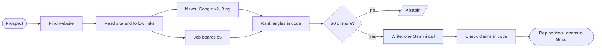

# AI-GTM: prospect to reviewed outreach draft

Case study build for Zamp's AI Solutions Associate role (PS-3, personalised outreach).

A rep names a prospect. The app confirms who they are, gathers dated public signals (news, hiring, company pages, the person's own interviews), ranks candidate hooks against a rubric, and writes a short draft where every claim links to its source. It pauses when it isn't sure who the person is, blocks sensitive news as a hook, and says so when there is nothing worth personalising on. A human approves, edits or rejects every draft. Nothing sends.

## How it works



Full logic and architecture diagrams: [docs/12-diagrams.md](docs/12-diagrams.md).

## Where things are

| File | What's in it |
|---|---|
| CLAUDE.md | Rules and context for coding sessions |
| TASKS.md | Day by day plan and checklist |
| LEARNING.md | Decisions, assumptions, things learned, test results |
| docs/01-assignment-breakdown.md | The brief, deliverables, what gets graded |
| docs/02-process-map.md | Pipeline stages and decision points |
| docs/03-prd.md | Requirements, UI, metrics, risks |
| docs/04-architecture.md | Stack, folders, data model, reliability |
| docs/05-edge-cases.md | The four edge cases |
| docs/06-hook-rubric-and-writing-rules.md | Hook scoring and draft rules |
| docs/07-demo-and-interview-prep.md | Video script, live run order, likely questions |
| docs/08-seller-brief-zamp.md | What the seller (Zamp) sells and to whom |
| docs/10-screens.md | Screens, visual language, charts |
| docs/11-system-constraints.md | Every limit and where it is enforced |
| docs/12-diagrams.md | Logic and architecture diagrams (Mermaid, rendered by GitHub) |
| docs/13-product-review.md | What's worth improving, and features to add next |
| docs/research/ | Research report, source notes, 16-minds review |

## Running it

```
npm install
npm run setup:browser   # once: downloads the headless Chromium the website crawler uses
npm run dev             # http://localhost:3000 (landing page), /app (new run)
```

Copy `.env.example` to `.env.local` and add the Gemini key. Without the browser the crawler falls back to plain HTML, which some large sites block. Without a key, use the recorded cases under "Try a case": they replay step by step with no model or network calls.
