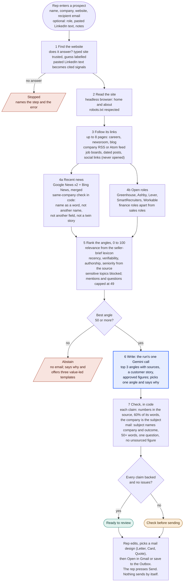
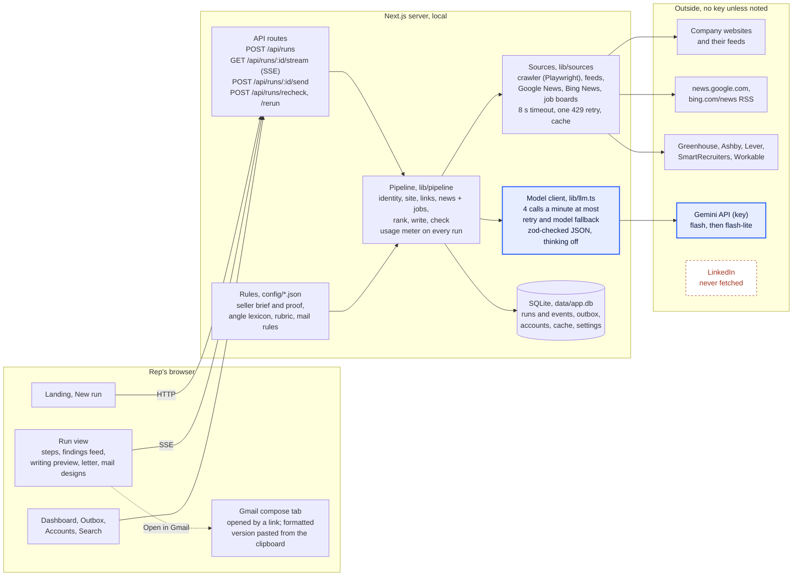

# Diagrams

Two views of the build, drawn in Mermaid so GitHub renders them in place. The logic diagram follows one prospect through every check and decision. The architecture diagram shows where each piece runs and what it talks to. Blue marks the run's only model call.

## Logic: one prospect, start to finish

## Architecture: where it runs

## Per draft

| | |
|---|---|
| Model calls | 1 |
| Tokens | about 1,300 to 1,800 (in, out; thinking off) |
| Paid sources | none |
| Free requests | about 7 to 20: site pages, its feed, three news feeds, job boards |
| Cache | 24 hours: a repeat run reads pages, feeds and answers locally |

A styled version of the same diagrams is published as a private page: https://claude.ai/artifact/NF2XW3hkjNeVbKuJgWQHGn (open it from your claude.ai account).
